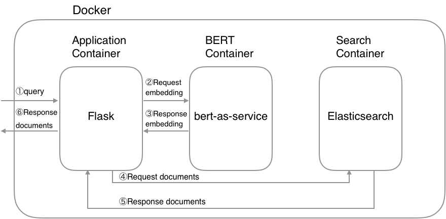

[](https://opensource.org/licenses/MIT)

# Neural Search Engine

This repository provides the implementation of a neural search engine for [RFC](https://en.wikipedia.org/wiki/Request_for_Comments) documents that use a pre-trained [NetBERT](https://github.com/antoiloui/netbert) model for information retrieval.

## Table of contents
1. [System Architecture](#architecture)
2. [Setup](#setup)
    1. [Requirements](#requirements)
    2. [Download a pre-trained NetBERT model](#download_netbert)
    3. [Launch the Docker containers](#launch)
3. [Index creation](#index_creation)
    1. [Download RFC data](#donwload_rfc)
    2. [Clean and process data](#process_rfc)
    3. [Convert data in proper format](#convert_data)
    4. [Create index](#create_index)
    5. [Create documents](#create_documents)
    6. [Index documents](#index_documents)
4. [Let's search!](#search)


## 1. System architecture <a name="architecture"></a>




## 2. Setup <a name="setup"></a>

### Requirements <a name="requirements"></a>
The following section lists the requirements in order to start running the project.

This project is based on Docker containers, so ensure to have [Docker](https://docs.docker.com/v17.12/install/) and [docker-compose](https://docs.docker.com/compose/install/) installed on your machine. In addition, your machine should dispose from a working version of Python 3.6 as well as the following packages:
- [bert-serving-client](https://pypi.org/project/bert-serving-client/)
- [elasticsearch](https://pypi.org/project/elasticsearch/)
- [pandas](https://pypi.org/project/pandas/)
- [transformers](https://pypi.org/project/transformers/)

These libraries can be installed automatically by running the following command in the *code/* repository:
```bash
pip install -r requirements.txt
```

### Download a pre-trained NetBERT model <a name="download_netbert"></a>
You can download the pre-trained [NetBERT](https://github.com/antoiloui/netbert) model with [🤗 transformers](https://github.com/huggingface/transformers) as follows:
```
from transformers import AutoTokenizer, AutoModel

# Load model.
tokenizer = AutoTokenizer.from_pretrained("antoiloui/netbert")
model = AutoModel.from_pretrained("antoiloui/netbert")

# Save it.
model.save_pretrained("path/to/local/folder")
tokenizer.save_pretrained("path/to/local/folder")
```

Then, you need to convert the 🤗 model checkpoint to the checkpoint format from original [BERT](https://github.com/google-research/bert) repository:
```bash
bash convert_model_checkpoint.sh $path/to/local/folder
```

This will create a new *'tensorflow'* repository where you should change the file names that way in order for the docker containers to run properly:
- *netbert_config.json* -> *bert_config.json*
- *netbert.ckpt.data-00000-of-00001* -> *bert_model.ckpt.data-00000-of-00001*
- *netbert.ckpt.index* -> *bert_model.ckpt.index*
- *netbert.ckpt.meta* -> *bert_model.ckpt.meta*

Finally, set the following environnement variable with the path of the folder containing the convert NetBERT checkpoint:
```
export PATH_MODEL=$path/to/local/folder/tensorflow
```

###  Launch the Docker containers <a name="launch"></a>
In order to run the containers, run the following command:
```bash
make install
```

## 3. Index creation <a name="index_creation"></a>

Go into the *'index_creation'* repository:
```bash
cd index_creation/
```

### Download RFC data <a name="download_rfc"></a>
```bash
bash download_data.sh $OUT_DIR
```

### Clean and process data <a name="process_rfc"></a>
```bash
bash clean_data.sh $DATA_DIR
```

### Convert data in proper format <a name="convert_data"></a>
```bash
bash convert_data_format.sh $DATA_DIR
```

### Create index <a name="create_index"></a>
You can use the create index API to add a new index to an Elasticsearch cluster. When creating an index, you can specify the following:
* Settings for the index
* Mappings for fields in the index
* Index aliases

For example, if you want to create `rfcsearch` index with `title`, `text` and `text_vector` fields, you can create the index by the following command:

```bash
$ bash create_index.sh

# index.json
{
  "settings": {
    "number_of_shards": 2,
    "number_of_replicas": 1
  },
  "mappings": {
    "dynamic": "true",
    "_source": {
      "enabled": "true"
    },
    "properties": {
      "title": {
        "type": "text"
      },
      "text": {
        "type": "text"
      },
      "text_vector": {
        "type": "dense_vector",
        "dims": 768
      }
    }
  }
}
```

*NB*: The `dims` value of `text_vector` must need to match the dims of a pretrained BERT model.


### Create documents <a name="create_documents"></a>
Once you created an index, you’re ready to index some document. The point here is to convert your document into a vector using BERT. The resulting vector is stored in the `text_vector` field. Let`s convert your data into a JSON document:

```bash
bash create_documents.sh $DATA_DIR $DATA_FILE

# $DATA_FILE=data/example.csv
"Title","Text"
"rfc1 - Host Software","Somewhat independently, Gerard DeLoche of UCLA has been working on the HOST-IMP interface."
"rfc153 - SRI ARC-NIC status","The specifications of DEL are under discussion. The following diagrams show the sequence of actions."
"rfc354 - File Transfer Protocol","The links have the following primitive characteristics. They are always functioning and there are always 32 of them."
"rfcxxx - Lorem Ipsum","Lorem Ipsum"
...
```

After finishing the script, you get a JSON document as follows:

```
# documents.json
{"_op_type": "index", "_index": "rfcsearch", "text": "lorem ipsum", "title": "lorem ipsum", "text_vector": [...]}
{"_op_type": "index", "_index": "rfcsearch", "text": "lorem ipsum", "title": "lorem ipsum", "text_vector": [...]}
{"_op_type": "index", "_index": "rfcsearch", "text": "lorem ipsum", "title": "lorem ipsum", "text_vector": [...]}
...
```

### Index documents <a name="index_documents"></a>
After converting your data into a JSON, you can adds a JSON document to the specified index and makes it searchable:
```bash
bash index_documents.sh $DATA_DIR
```

## 4. Let's search! <a name="search"></a>

Open browser and go to http://127.0.0.1:5000.

***

***Credits*** This project was inspired by [Hironsan](https://github.com/Hironsan/bertsearch).
